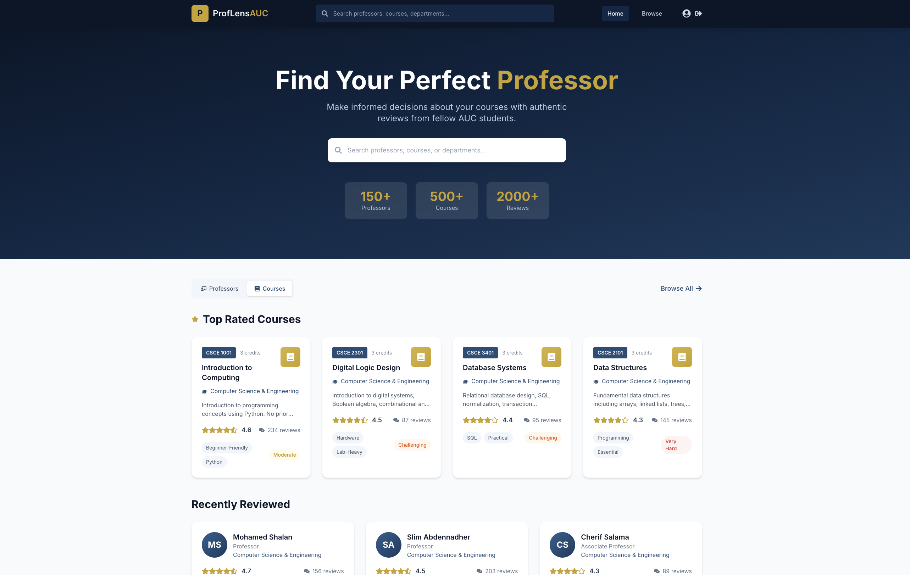

# ProfLens AUC - Frontend (Milestone 2)

A React-based frontend for ProfLens AUC - a professor and course review platform for The American University in Cairo.

## Screenshots

### Login Page


### Home Page - Professors View


### Home Page - Courses View


### Home Page - Additional Sections


### Search Functionality


### Professor Review Page


### Submit Review Page


## Project Overview

ProfLens AUC is a web-based platform that allows AUC students to:
- Browse and search professors and courses
- Read reviews from fellow students
- Submit anonymous reviews with standardized rating criteria
- Filter and sort reviews by various metrics

## Technologies Used

- **React 18** - Frontend framework
- **React Router v6** - Client-side routing
- **Tailwind CSS** - Utility-first CSS framework
- **React Icons** - Icon library

## Features (Milestone 2 Requirements)

### Responsive UI
- Mobile-first design with full responsiveness
- Custom color scheme matching AUC branding
- Smooth animations and transitions

### React Components (3+ required)
1. **Navbar** - Navigation bar with search functionality
2. **ProfessorCard** - Professor display card
3. **CourseCard** - Course display card
4. **ReviewCard** - Review display component
5. **StarRating** - Interactive star rating (display and input)
6. **Button** - Reusable button component
7. **Input** - Form input with validation
8. **TextArea** - Multi-line input with character count
9. **FilterDropdown** - Filter selection component
10. **RatingBar** - Visual rating progress bar

### Form Handling & Validation
- Login/Signup form with AUC email validation
- Review submission form with:
  - Required field validation
  - Minimum character length requirements
  - Star rating validation
  - Real-time error feedback

### Navigation (React Router)
- `/` - Login page
- `/home` - Dashboard/Homepage
- `/professor/:id` - Professor review page
- `/course/:id` - Course review page
- `/search` - Search results with filters
- `/submit-review/:type/:id` - Review submission form

## Getting Started

### Prerequisites
- Node.js (v16 or higher)
- npm or yarn

### Installation

1. Navigate to the Milestone 2 directory:
```bash
cd "Milestone 2"
```

2. Install dependencies:
```bash
npm install
```

3. Start the development server:
```bash
npm start
```

4. Open [http://localhost:3000](http://localhost:3000) in your browser.

## Project Structure

```
Milestone 2/
├── public/
│   ├── index.html
│   ├── manifest.json
│   └── robots.txt
├── src/
│   ├── components/
│   │   ├── Button.jsx
│   │   ├── CourseCard.jsx
│   │   ├── FilterDropdown.jsx
│   │   ├── Input.jsx
│   │   ├── Navbar.jsx
│   │   ├── ProfessorCard.jsx
│   │   ├── RatingBar.jsx
│   │   ├── ReviewCard.jsx
│   │   ├── StarRating.jsx
│   │   ├── TextArea.jsx
│   │   └── index.js
│   ├── data/
│   │   └── mockData.js
│   ├── pages/
│   │   ├── CourseReviewPage.jsx
│   │   ├── HomePage.jsx
│   │   ├── LoginPage.jsx
│   │   ├── ProfessorReviewPage.jsx
│   │   ├── SearchResultsPage.jsx
│   │   ├── SubmitReviewPage.jsx
│   │   └── index.js
│   ├── App.js
│   ├── index.css
│   └── index.js
├── package.json
├── tailwind.config.js
├── postcss.config.js
└── README.md
```

## Available Scripts

- `npm start` - Runs the app in development mode
- `npm build` - Builds the app for production
- `npm test` - Runs the test suite

## Mock Data

The application uses mock data located in `src/data/mockData.js` which includes:
- Sample professors with ratings and reviews
- Sample courses with details
- Review data for demonstration

This mock data will be replaced with actual API calls in Milestone 3 (Backend Development).

## Evaluation Criteria Addressed

| Criteria | Implementation |
|----------|---------------|
| UI design & responsiveness (4 marks) | Tailwind CSS, mobile-first design, AUC branding |
| Functionality & React component structure (4 marks) | 10+ reusable components, proper state management |
| Code quality & best practices (2 marks) | Component organization, ES6+, clean code structure |

## Authors

- Youssef Elmahdy - 900212370
- Mariam Shoukry - 900221804
- Youssef Anan - 900211132

## Next Steps (Milestone 3)

- Backend API implementation with Node.js/Express
- MongoDB/PostgreSQL database integration
- User authentication with JWT
- API endpoints for CRUD operations
