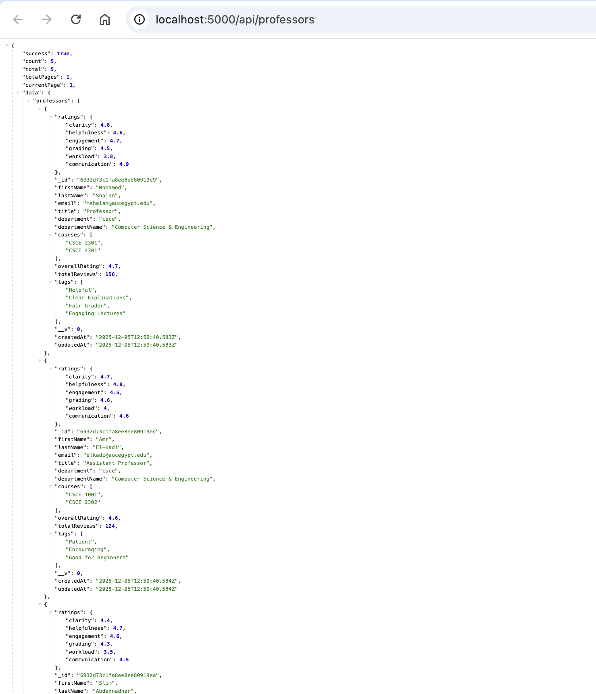
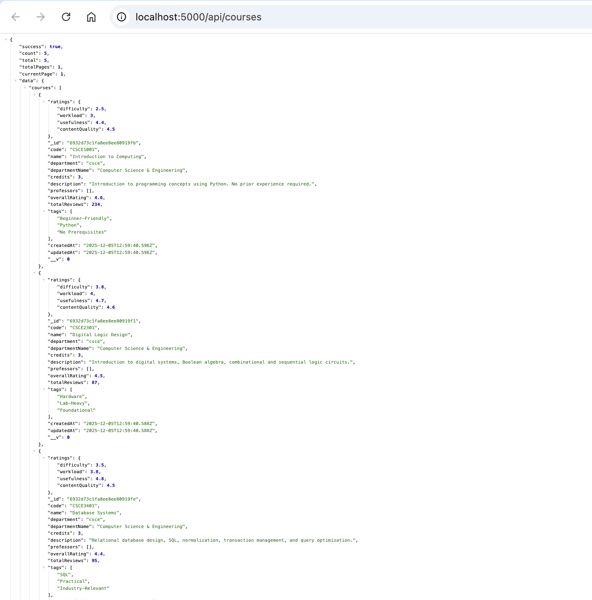
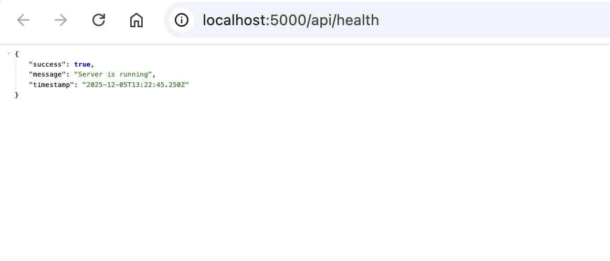
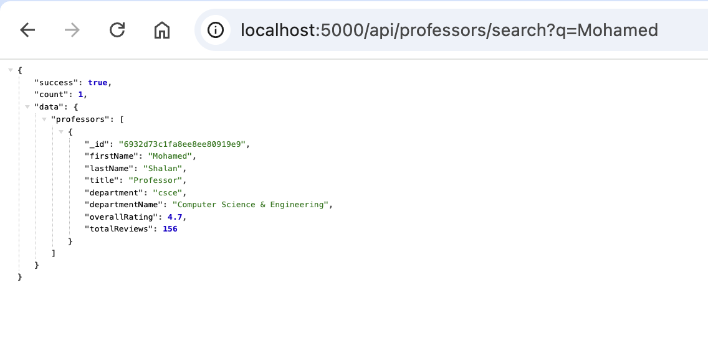

# ProfLens AUC - Backend API (Milestone 3)

A RESTful API backend for ProfLens AUC built with Node.js, Express.js, and MongoDB.

## Project Overview

This is the complete backend implementation for ProfLens AUC, providing:
- User authentication with JWT
- CRUD operations for professors, courses, and reviews
- Advanced search and filtering
- Rating aggregation system
- Error handling and logging
- Input validation and security measures

## Technologies Used

- **Node.js** - Runtime environment
- **Express.js** - Web framework
- **MongoDB** - NoSQL database
- **Mongoose** - ODM for MongoDB
- **JWT** - JSON Web Tokens for authentication
- **bcryptjs** - Password hashing
- **express-validator** - Input validation
- **helmet** - Security headers
- **morgan** - HTTP request logging
- **winston** - Application logging

## Features (Milestone 3 Requirements)

### RESTful API (4+ Endpoints)
- **Authentication**: Register, Login, Profile management
- **Professors**: Create, Read, Update, Delete, Search
- **Courses**: Create, Read, Update, Delete, Search
- **Reviews**: Create, Read, Update, Delete, Mark helpful

### Database Integration (2+ Entities)
- **Users** - Student accounts with authentication
- **Professors** - Faculty members with ratings
- **Courses** - Course information
- **Reviews** - Student reviews for professors and courses

### User Authentication (JWT)
- Secure password hashing with bcrypt
- JWT token generation and verification
- Protected routes requiring authentication
- Role-based access control (Student/Admin)

### Middleware
- **Error Handling** - Centralized error handling with custom error class
- **Logging** - Request logging (Morgan) and application logging (Winston)
- **Validation** - Input validation using express-validator
- **Security** - Helmet, CORS, Rate limiting

## Getting Started

### Prerequisites

- Node.js (v16 or higher)
- MongoDB (local or Atlas)
- npm or yarn

### Installation

1. Navigate to the Milestone 3 directory:
```bash
cd "Milestone 3"
```

2. Install dependencies:
```bash
npm install
```

3. Create environment file:
```bash
cp .env.example .env
```

4. Configure your `.env` file:
```env
PORT=5000
NODE_ENV=development
MONGODB_URI=mongodb://localhost:27017/proflens_auc
JWT_SECRET=your-secret-key-here
JWT_EXPIRE=7d
FRONTEND_URL=http://localhost:3000
```

5. Seed the database (optional):
```bash
npm run seed
```

6. Start the server:
```bash
# Development mode with auto-reload
npm run dev

# Production mode
npm start
```

The API will be available at `http://localhost:5000`

## API Documentation

### Base URL
```
http://localhost:5000/api
```

### Authentication Endpoints

#### Register
```http
POST /api/auth/register
Content-Type: application/json

{
  "email": "student@aucegypt.edu",
  "password": "password123",
  "firstName": "John",
  "lastName": "Doe",
  "major": "Computer Science",
  "graduationYear": 2025
}
```

#### Login
```http
POST /api/auth/login
Content-Type: application/json

{
  "email": "student@aucegypt.edu",
  "password": "password123"
}
```

#### Get Current User
```http
GET /api/auth/me
Authorization: Bearer <token>
```

### Professor Endpoints

#### Get All Professors
```http
GET /api/professors
GET /api/professors?department=csce&minRating=4.0&page=1&limit=20
```

#### Get Single Professor
```http
GET /api/professors/:id
```

#### Search Professors
```http
GET /api/professors/search?q=Mohamed
```

#### Create Professor (Admin Only)
```http
POST /api/professors
Authorization: Bearer <admin-token>
Content-Type: application/json

{
  "firstName": "John",
  "lastName": "Smith",
  "email": "jsmith@aucegypt.edu",
  "title": "Professor",
  "department": "csce",
  "departmentName": "Computer Science & Engineering"
}
```

#### Update Professor (Admin Only)
```http
PUT /api/professors/:id
Authorization: Bearer <admin-token>
```

#### Delete Professor (Admin Only)
```http
DELETE /api/professors/:id
Authorization: Bearer <admin-token>
```

### Course Endpoints

#### Get All Courses
```http
GET /api/courses
GET /api/courses?department=csce&minRating=4.0&page=1&limit=20
```

#### Get Single Course
```http
GET /api/courses/:id
```

#### Search Courses
```http
GET /api/courses/search?q=Data Structures
```

#### Create Course (Admin Only)
```http
POST /api/courses
Authorization: Bearer <admin-token>
Content-Type: application/json

{
  "code": "CSCE2301",
  "name": "Digital Logic Design",
  "department": "csce",
  "departmentName": "Computer Science & Engineering",
  "credits": 3,
  "description": "Introduction to digital systems..."
}
```

### Review Endpoints

#### Get All Reviews
```http
GET /api/reviews
GET /api/reviews?type=professor&professorId=<id>
GET /api/reviews?type=course&courseId=<id>
```

#### Create Review
```http
POST /api/reviews
Authorization: Bearer <token>
Content-Type: application/json

{
  "type": "professor",
  "professorId": "<professor-id>",
  "rating": 5,
  "clarity": 5,
  "helpfulness": 5,
  "engagement": 4,
  "grading": 5,
  "workload": 4,
  "communication": 5,
  "comment": "Excellent professor! Very clear explanations...",
  "anonymous": true
}
```

#### Update Review
```http
PUT /api/reviews/:id
Authorization: Bearer <token>
```

#### Delete Review
```http
DELETE /api/reviews/:id
Authorization: Bearer <token>
```

#### Mark Review as Helpful
```http
PUT /api/reviews/:id/helpful
Authorization: Bearer <token>
```

## Database Schema

### User Model
```javascript
{
  email: String (unique, @aucegypt.edu),
  password: String (hashed),
  firstName: String,
  lastName: String,
  major: String,
  graduationYear: Number,
  role: String (student/admin),
  isActive: Boolean,
  reviewsSubmitted: [Review]
}
```

### Professor Model
```javascript
{
  firstName: String,
  lastName: String,
  email: String (unique),
  title: String,
  department: String,
  departmentName: String,
  courses: [String],
  overallRating: Number,
  totalReviews: Number,
  ratings: {
    clarity, helpfulness, engagement,
    grading, workload, communication
  },
  tags: [String],
  reviews: [Review]
}
```

### Course Model
```javascript
{
  code: String (unique),
  name: String,
  department: String,
  departmentName: String,
  credits: Number,
  description: String,
  professors: [Professor],
  overallRating: Number,
  totalReviews: Number,
  ratings: {
    difficulty, workload,
    usefulness, contentQuality
  },
  tags: [String],
  reviews: [Review]
}
```

### Review Model
```javascript
{
  user: User,
  type: String (professor/course),
  professor: Professor,
  course: Course,
  rating: Number (1-5),
  // Professor-specific
  clarity, helpfulness, engagement,
  grading, workload, communication,
  // Course-specific
  difficulty, usefulness, contentQuality,
  comment: String,
  semester: String,
  anonymous: Boolean,
  verified: Boolean,
  helpful: Number,
  helpfulBy: [User]
}
```

## Security Features

1. **Password Hashing** - bcrypt with salt rounds
2. **JWT Authentication** - Secure token-based auth
3. **Input Validation** - express-validator for all inputs
4. **Rate Limiting** - Prevent brute force attacks
5. **Helmet** - Security headers
6. **CORS** - Cross-Origin Resource Sharing configuration
7. **Email Validation** - Only @aucegypt.edu emails allowed
8. **Role-Based Access** - Admin-only routes for sensitive operations

## Error Handling

All errors are handled centrally and return consistent JSON responses:

```json
{
  "success": false,
  "message": "Error message here"
}
```

## Logging

- **Development**: Console logging with colors
- **Production**: File-based logging with Winston
  - `logs/error.log` - Error logs
  - `logs/combined.log` - All logs

## Testing Credentials

After running the seed script:

- **Student Account**: `student@aucegypt.edu` / `password123`
- **Admin Account**: `admin@aucegypt.edu` / `admin123`

## Project Structure

```
Milestone 3/
├── config/
│   └── database.js          # MongoDB connection
├── controllers/
│   ├── authController.js    # Authentication logic
│   ├── courseController.js  # Course CRUD
│   ├── professorController.js
│   └── reviewController.js
├── middleware/
│   ├── auth.js             # JWT authentication
│   ├── errorHandler.js     # Error handling
│   └── validator.js        # Input validation
├── models/
│   ├── User.js
│   ├── Professor.js
│   ├── Course.js
│   └── Review.js
├── routes/
│   ├── auth.js
│   ├── professors.js
│   ├── courses.js
│   └── reviews.js
├── scripts/
│   └── seedDatabase.js     # Database seeding
├── utils/
│   └── logger.js           # Winston logger
├── logs/                   # Log files
├── .env.example
├── .gitignore
├── package.json
├── server.js               # Main entry point
└── README.md
```

## Screenshots

### API Endpoints in Action

#### Professors Endpoint

*GET /api/professors - Returns all professors with ratings and details*

#### Courses Endpoint

*GET /api/courses - Returns all courses with ratings and information*

#### Health Check Endpoint

*GET /api/health - Server health check endpoint*

#### Search Endpoint

*GET /api/professors/search?q=Mohamed - Search functionality returning matching professor*

## Evaluation Criteria Addressed

| Criteria | Implementation |
|----------|---------------|
| **Functionality & API design (4 marks)** | RESTful API with 20+ endpoints, proper HTTP methods, query parameters, pagination |
| **Database schema & data handling (4 marks)** | 4 MongoDB models with relationships, indexes, validation, rating aggregation |
| **Code quality & security (2 marks)** | JWT auth, password hashing, input validation, error handling, logging, rate limiting |

## Authors

- Youssef Elmahdy - 900212370
- Mariam Shoukry - 900221804
- Youssef Anan - 900211132

## Next Steps (Milestone 4)

- Integration with frontend from Milestone 2
- Deployment to cloud platform (Render/Heroku)
- Environment-specific configurations
- Additional testing and optimization
